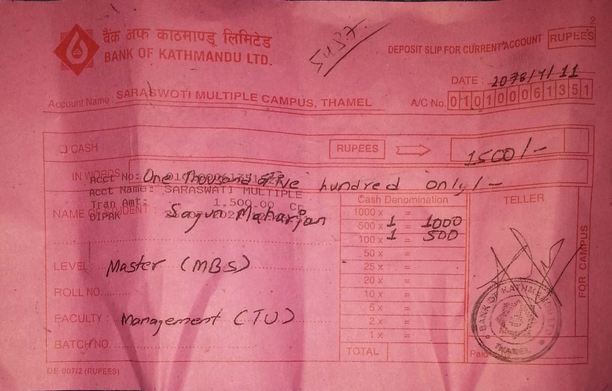

# 1-Headings
How to give headings in markdown files?
# Heading 1
## Heading 2
### Heading 3
#### Heading 4
###### so on

# 2-Block of words

This is a normal text in Markdown.

> This is a block of special text.
> 
> This is a second line.

# 3-Line breaks
This is a 40 days long course Data Science with Python AKA Python_ka_chilla_with_baba_aamar.\
This is a second line.

# 4-Combine two things

Block of words and heading
> ## Heading 2

# 5-Face of text
**Bold**
*Italic*
***Bold and Italic***

or you can use these symbol
_(Underscore)
__Bold__
_Italic_
___BOLD AND Italic___

# 6-Bullet points/Lists
- Day-1
- Day-2
- Day-3
- Day-4
- Day-5
    - Day-5a
        - Sub list(anything)
    - Day-5b
- Day-6
- Day-7

> __using * or+__


  > Numbering of lists
  1. Day1
  2. Day 2
  3. Day 3
  4. Day 4
  5. Day 4 

# 7- Line breaks or page breaks

This is page 1.

---
___
***
This is page 2.

# 8- Links and Hyperlinks
<https://www.youtube.com/watch?v=qJqAXjz-Rh4&t=5s&ab_channel=Codanics>

[The playlist of python ka chilla is here]()

[Codanics]:(hhttps://www.youtube.com/watch?v=QvPekMN4F0w&list=PL9XvIvvVL50HVsu-Ao8NBr0UJSO8O6lBI&ab_channel=Codanics)
This whole course is [here][Codanics]

# 9- Image and Figures with link

To jon this course please scan the followng QR code and join tleegram group:


<!---Comment out the line-->

# 10- Adding code or code block
To print a string use `print("Codanics")`
`print("Hello Baba")`
```python
x=5+6
y=3+2
z=x+y
print(z)
```

>Ths code with show color according to r language syntax

```r
x=5+6
y=3+2
z=x+y
print(z)
```

# 11-adding tables
| Species | petal_length | sepal_length |
| :-------: | :------------: | :------------: |
| vrginica| 18.2 | 19.2|
|setosa | 15.1 | 17.2|
|versicolor |12.1| 12.2|

# 12- content
[1- Headings](#1-headings)\
[2- Block of words](#2-block-of-words)\
[3- Line Breaks](#3-line-breaks)


#13 - Install extensions

**Sample Text**
**Bold**
_Italic_
_**_Italic and Bold_**_

[Link](https://www.youtube.com/watch?v=qJqAXjz-Rh4&t=5s&ab_channel=Codanics)


Column A | Column B | Column C
---------|----------|---------
 A1 | B1 | C1
 A2 | B2 | C2
 A3 | B3 | C3


Column A | Column B | Column C
---------|----------|---------
 A1 | B1 | C1
 A2 | B2 | C2
 A3 | B3 | C3